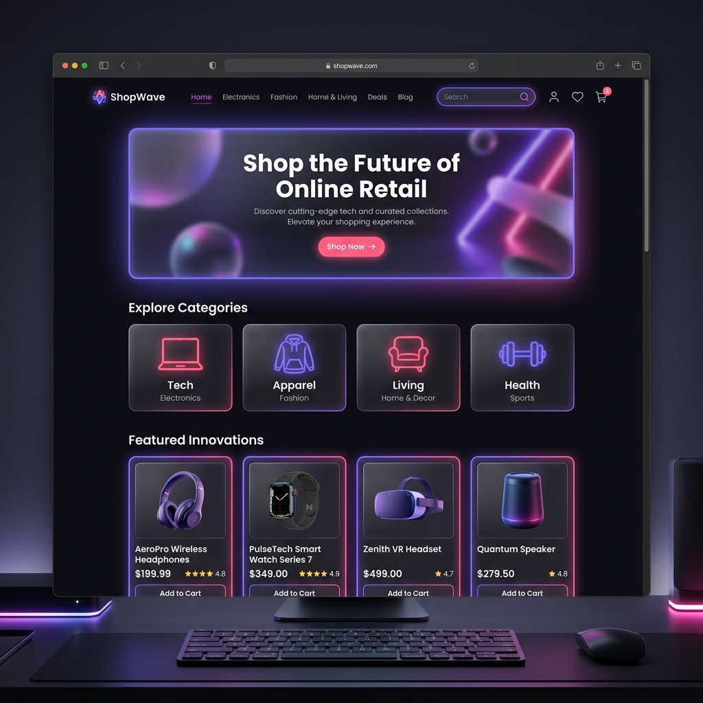
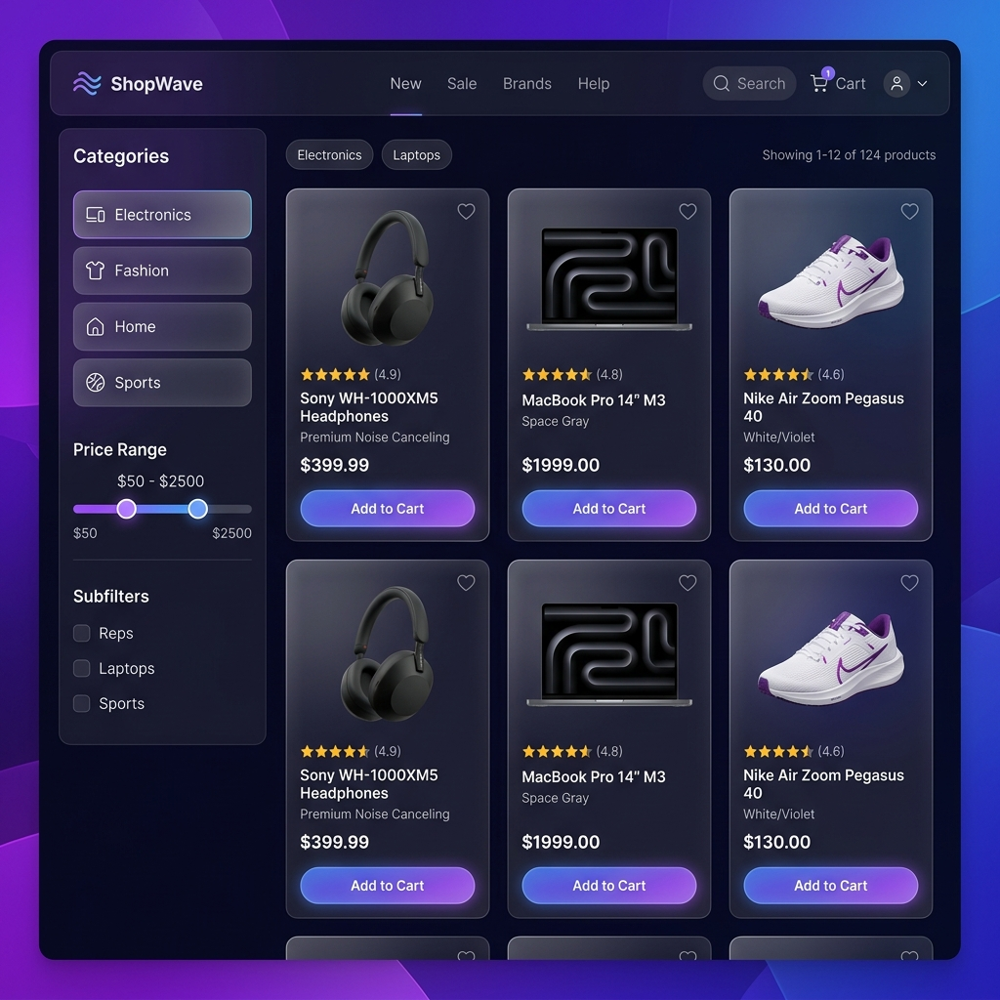
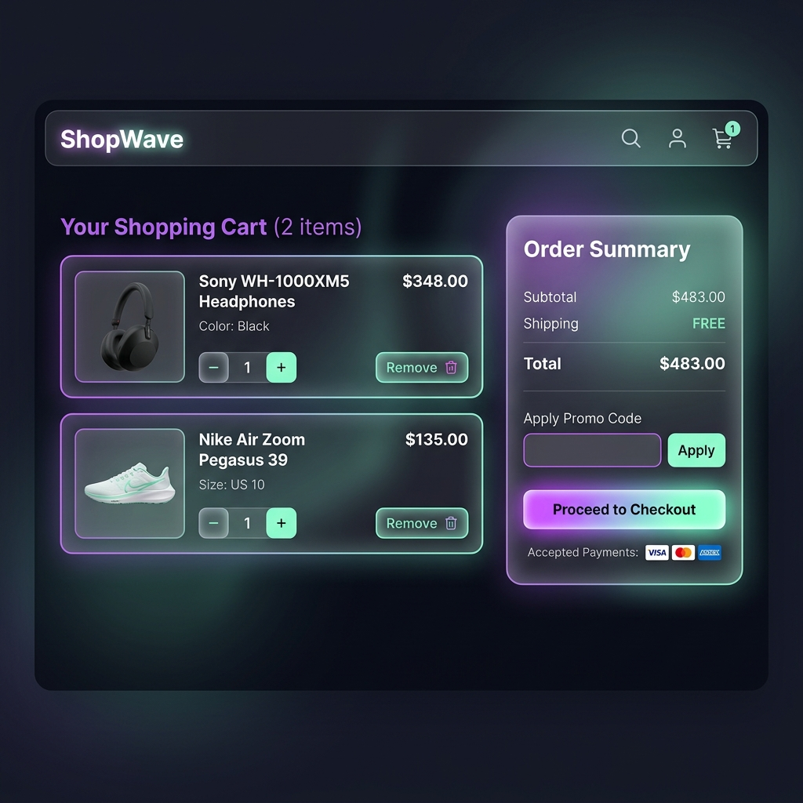

<div align="center">

# 🛍️ ShopWave
### Premium E-Commerce Online Shopping Platform


*A fully functional, premium-designed e-commerce website built with React, featuring a dark glassmorphism UI, real-time cart management, product filtering, and a simulated checkout experience.*

[🚀 Live Demo](#getting-started) · [📸 Screenshots](#screenshots) · [✨ Features](#features) · [👥 Team](#team)

---

</div>

## 📸 Screenshots

### 🏠 Homepage — Hero & Featured Products

> *Dynamic hero section with animated floating product cards, category navigation, featured products grid, and promotional banner.*

---

### 🛒 Product Catalog — Filter & Browse

> *Full product listing with sidebar filters (category, price range), live search bar, sort options, and a responsive product grid with badges and ratings.*

---

### 🧾 Shopping Cart — Order Summary

> *Fully functional cart with quantity controls, item removal, promo code support (`SAVE10`), dynamic shipping calculation, and an order success screen.*

---

## ✨ Features

| Feature | Description |
|---|---|
| 🏠 **Homepage** | Hero banner, animated floating cards, trust badges, category section, featured products, promo banner |
| 📦 **Product Listing** | 16 products across 4 categories, filterable by category & price, searchable, sortable |
| 🔍 **Product Detail** | Full product page with image, specs, quantity selector, tabbed sections (Description / Features / Reviews), related products |
| 🛒 **Shopping Cart** | Add/remove items, update quantities, persistent cart via localStorage |
| 💰 **Price Calculation** | Real-time subtotal, automatic free shipping over $50, savings display |
| 🎟️ **Promo Codes** | Apply `SAVE10` for 10% discount |
| ✅ **Order Checkout** | Simulated checkout with animated order confirmation screen |
| 📱 **Responsive Design** | Fully optimized for mobile, tablet, and desktop with hamburger menu |
| 💾 **Cart Persistence** | Cart state saved to `localStorage` — survives page refresh |
| 🌙 **Dark Mode UI** | Glassmorphism dark theme with gradient accents throughout |

---

## 🗂️ Project Structure

```
internet_project/
├── public/
│   └── index.html              # HTML entry point with SEO meta tags
├── src/
│   ├── context/
│   │   └── CartContext.js      # Global cart state (React Context + useReducer)
│   ├── components/
│   │   ├── Navbar.js           # Sticky navbar with cart badge & mobile menu
│   │   ├── ProductCard.js      # Reusable product card with ratings & add-to-cart
│   │   └── Footer.js           # Footer with links, social icons, payment badges
│   ├── pages/
│   │   ├── HomePage.js         # Landing page with hero, categories, featured items
│   │   ├── ProductsPage.js     # Product listing with filters & search
│   │   ├── ProductDetailPage.js# Individual product view with tabs & related items
│   │   ├── CartPage.js         # Shopping cart with order summary & checkout
│   │   └── AboutPage.js        # Team info, tech stack, project features
│   ├── data/
│   │   └── products.js         # Product catalog data (16 products, 4 categories)
│   ├── App.js                  # Root component — routing & page state
│   ├── App.css                 # All component & page styles (dark glassmorphism)
│   └── index.css               # Global resets & CSS custom properties
├── docs/
│   └── images/                 # README screenshots
└── README.md
```

---

## 🛠️ Technologies Used

| Technology | Purpose |
|---|---|
| **HTML5** | Semantic page structure, forms, accessibility |
| **CSS3** | Glassmorphism, animations, gradients, responsive layout, custom properties |
| **JavaScript (ES6+)** | Cart logic, filtering, sorting, search, LocalStorage |
| **React 19** | Component-based UI, hooks (`useState`, `useReducer`, `useContext`, `useEffect`, `useMemo`) |
| **React Context API** | Global cart state shared across all components |
| **LocalStorage** | Cart persistence between sessions |

---

## 🚀 Getting Started

### Prerequisites
- Node.js ≥ 16.x
- npm ≥ 8.x

### Installation & Run

```bash
# 1. Clone the repository
git clone https://github.com/mohab3-user/ShopWave.git

# 2. Navigate to project directory
cd ShopWave

# 3. Install dependencies
npm install

# 4. Start the development server
npm start
```

Open **http://localhost:3000** in your browser.

### Build for Production

```bash
npm run build
```

---

## 🛍️ Product Categories

| Category | Products | Price Range |
|---|---|---|
| 💻 **Electronics** | Sony Headphones, MacBook Pro, Samsung Galaxy S24, iPad Pro | $349 – $1,999 |
| 👟 **Fashion** | Nike Air Max, Levi's Jeans, Ray-Ban Aviators, Adidas Ultraboost | $38 – $190 |
| 🏠 **Home & Kitchen** | Nespresso, Dyson Vacuum, Instant Pot, KitchenAid Mixer | $90 – $700 |
| ⚽ **Sports** | Peloton Bike+, Garmin Fenix 7, Wilson Tennis Racket, Yeti Tumbler | $38 – $2,495 |

---

## 💡 How to Use

1. **Browse** — Visit the homepage and explore featured products or click a category
2. **Search & Filter** — Use the Products page to filter by category, price, or search by name
3. **View Details** — Click any product card for full specs, reviews, and related items
4. **Add to Cart** — Add items with the "Add to Cart" button; adjust quantities in the cart
5. **Apply Promo** — Enter promo code **`SAVE10`** at checkout for 10% off
6. **Checkout** — Click "Proceed to Checkout" to see the order success screen

---

## 👥 Team

<div align="center">

| Name | Student ID | Role |
|---|---|---|
| Ahmed Mohamed Abou EL Yazid | 2401317 | Frontend Developer |
| Mohab Ahmed Nayel | 2401307 | UI/UX Designer |
| Moataz Ahmed Khaifa | 2401315 | JavaScript Developer |
| Ahmed Mokhtar Farag | 2401338 | Backend & Logic |

**Internet Programming Project — Level 2, Semester 2**

</div>

---

## 📋 Development Plan

The project was developed following a structured 5-step plan:

1. **Planning** — Defined pages, features, and component architecture
2. **Design (HTML & CSS)** — Built the dark glassmorphism UI system with CSS custom properties
3. **Functionality (JavaScript)** — Implemented cart logic, filtering, search, and routing
4. **Testing** — Tested all features: add/remove cart items, promo codes, responsive layout
5. **Final Review** — Code cleanup, README documentation, and deployment prep

---

## 🎓 Learning Outcomes

This project demonstrates practical mastery of:
- **Component-based architecture** with React functional components and hooks
- **Global state management** using Context API and `useReducer`
- **Modern CSS** — glassmorphism, CSS variables, keyframe animations, responsive grid
- **JavaScript fundamentals** — array methods, localStorage, event handling
- **UX design principles** — micro-animations, visual hierarchy, accessibility

---

<div align="center">

Made with ❤️ by **Team ShopWave** · Internet Programming Project · 2024

</div>
